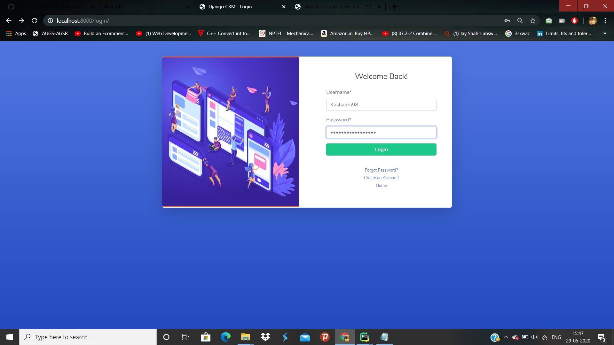

1. Download the file or clone it.
2. Then from the command prompt terminal, go to the projects directory and write
```pip install -r requirements.txt```

3. Then write ```python manage.py makemigrations``` and then ```python manage.py migrate.```
4. Then run the project with ```python manage.py runserver```.
5. On the browser write localhost:8000 and see the below page


Now register on it as follows:


Now login in it with the same credentials.



You will notice the following screen coming up.


You can also login with **Facebook**. For that with the developer account you need to mention your developer respective keys in the **settings.py** file as follows.


After that log in with facebook


You can also update profile as follows:


I have also included the forgot password option. Check this out


After that you will get the mail with the link. Since it is in initial stage we can do it from the link provided with it on the terminal.


Thanks for visiting the website.